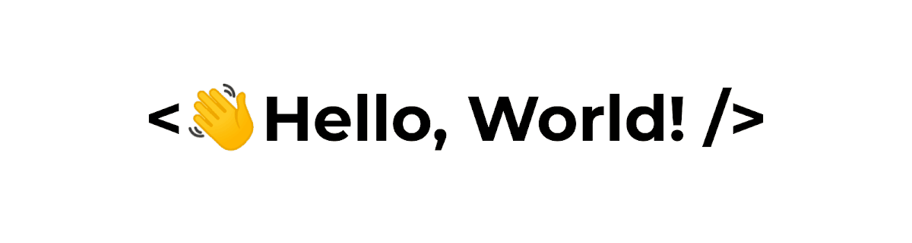

  

<h1 align="center">Miles R. W. Judd</h1>

  <strong>Machine Learning Engineer · Oxford DPhil (Engineering Science)</strong> 
  Scientific Machine Learning · Engineering Simulation · Computer Vision

---

## 👨‍💻 About Me

I am a Machine Learning Engineer with a background in Engineering Science from the University of Oxford. My work sits at the intersection of scientific machine learning, computer vision, and engineering simulation.

I have experience developing simulation-driven ML pipelines, physics-informed models, and robust reconstruction systems for inverse problems. My work combines finite-element modelling, synthetic data generation, computer vision, and machine learning to solve challenging real-world engineering problems.

Most recently, I developed scalable simulation pipelines for generating training data for physics-informed neural networks (PINNs), designed domain-randomisation strategies to improve model generalisation, and built validation and failure-detection frameworks for robust deployment.

My interests include scientific machine learning, surrogate modelling, inverse problems, scientific computing, robust ML systems, and AI-assisted engineering workflows.

---

## 🔬 Research & Engineering Interests

- Scientific Machine Learning
- Physics-Informed Neural Networks (PINNs)
- Engineering Simulation & Finite Element Analysis
- Inverse Problems & Computational Imaging
- Surrogate Modelling
- Robust ML & Failure Detection
- Computer Vision
- Scientific Computing
- AI for Engineering Workflows
- LLMs and Retrieval Systems for Technical Knowledge

---

## 🛠 Technical Skills

### Machine Learning & Scientific AI

- PyTorch
- scikit-learn
- Physics-Informed Neural Networks (PINNs)
- Data Augmentation & Domain Randomisation
- Model Validation & Benchmarking
- Failure Detection & Robustness Evaluation
- Synthetic Data Generation

### Simulation & Engineering

- ANSYS
- Abaqus
- DIANA FEA
- Finite Element Analysis (FEA)
- Digital Image Correlation (DIC)
- Virtual Fields Method (VFM)
- CAD

### Scientific Computing

- Inverse Problems
- Numerical Methods
- Computational Imaging
- Engineering Data Analysis
- Simulation-Driven Machine Learning

### Programming

- Python (NumPy, Pandas, scikit-learn)
- SQL
- MATLAB
- Git

---

## 🚀 Selected Projects

### Simulation-Driven Machine Learning

Development of simulation-based workflows for generating synthetic datasets used to train and evaluate machine learning models for engineering applications.

### Physics-Informed Reconstruction

Machine learning and optimisation approaches for solving inverse problems using imaging data, finite-element models, and physics-based constraints.

### Robust ML Systems

Validation, uncertainty estimation, and failure-detection frameworks designed to identify unreliable predictions and improve deployment robustness.

### Computer Vision for Engineering

Vision-based pipelines for deformation measurement, material characterisation, and structural assessment using high-resolution imaging data.

---

## 📚 Publications

### **2025**
- **Judd, M. R. W., Wilson, R., Sangirardi, M., Pulatsu, B., & Acikgoz, S.**  
  *Experimental characterisation of hydraulic lime mortar and clay brick elasticity using the Virtual Fields Method.*  
  **Construction and Building Materials**, vol. 493.  
  🔗 https://doi.org/10.1016/j.conbuildmat.2025.143076

- **Judd, M. R. W., Sangirardi, M., & Acikgoz, S.**  
  *The influence of Digital Image Correlation parameters on the accuracy of elastic property identification of brick and mortar from compression stack tests.*  
  **18th International Brick and Block Masonry Conference (IB2MaC 2024)**, *Lecture Notes in Civil Engineering*, vol. 614.  
  🔗 https://doi.org/10.1007/978-3-031-73310-9_80

- **Sangirardi, M., Judd, M. R. W., & Acikgoz, S.**  
  *Identification of Softening Constitutive Properties of Brittle Materials Using the Virtual Fields Method.*  
  **IB2MaC 2024**, *Lecture Notes in Civil Engineering*, vol. 613, pp. 341–350.  
  🔗 https://doi.org/10.1007/978-3-031-73314-7_25

---

### **2024**
- **Judd, M. R. W., Sangirardi, M., & Acikgoz, S.**  
  *A Practical Method for Robust Elastic Characterisation of Mortar in Flat Jack Tests.*  
  **SSRN Preprint**.  
  🔗 http://dx.doi.org/10.2139/ssrn.4990690

- **Judd, M. R. W., Sangirardi, M., & Acikgoz, S.**  
  *Virtual fields characterisation of elasticity in mortars.*  
  **SUBLime Conference 2024**, pp. 99–100.

- **Judd, M., Squires, D., Akcicek, K., Sangirardi, M., & Acikgoz, S.**  
  *Does Lack of CO₂ Control in Environmental Chambers Influence the Strength and Stiffness of Hydraulic Lime Mortars?*  
  **MATEC Web of Conferences**, vol. 403, Article 02002.  
  🔗 https://doi.org/10.1051/matecconf/202440302002

---

### **2023**
- **Judd, M. R. W., Sangirardi, M., & Acikgoz, S.**  
  *A Modified Virtual Fields Approach to Identify the Mechanical Properties of Mortar in Existing Masonry Structures Without Loading Information.*  
  **SAHC 2023**, *RILEM Bookseries*, vol. 47.  
  🔗 https://doi.org/10.1007/978-3-031-39603-8_34

- **Sangirardi, M., Judd, M. R. W., & Acikgoz, S.**  
  *Determining the Young’s Modulus of Lime Mortar Using the Virtual Fields Method.*  
  **SAHC 2023**, *RILEM Bookseries*, vol. 47.  
  🔗 https://doi.org/10.1007/978-3-031-39603-8_35

---

### **2022**
- **Gille, M., Judd, M. R. W., & Rixen, D. J.**  
  *Stereoscopic High-Speed Camera-Based Operational Modal Analysis Using a One-Camera Setup.*  
  **Conference Proceedings of the Society for Experimental Mechanics Series**, Volume 6.  
  🔗 https://doi.org/10.1007/978-3-031-04098-6_11

---

## 🏆 Awards & Honors

- 🌍 **Most Potential for Climate Impact Award** — EarthAI x Climate Impact Summit Hackathon (2024)
- 🎓 **Netzwerk-Engagement Scholarship** (2024)
- 🧪 **GDCh Prize** — Best performance in chemistry
- ⭐ **e-fellows.net Scholarship** for academic excellence
- 🏅 **Stiftung Bayerische EliteAkademie Scholarship** (21st cohort)

---

## 🤝 Open to Collaboration

I am interested in collaborations - feel free to reach out or explore my repositories below.
